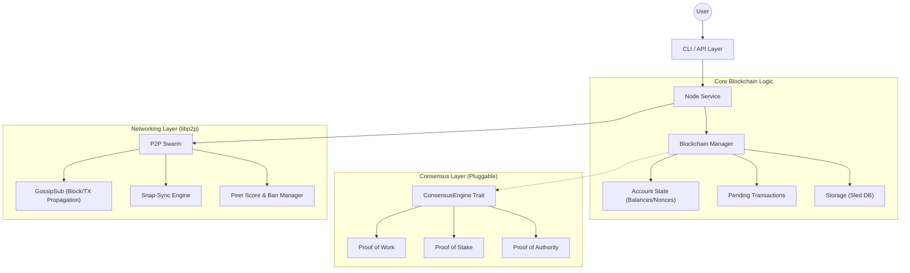

# Budlum Blockchain Core

**Budlum Core** is a production-grade, modular blockchain framework written in Rust. It serves as a high-performance Layer-1 blockchain featuring pluggable consensus engines (PoW, PoS, PoA), a hardened libp2p-based networking stack, and an atomic, account-based state model.

The architecture emphasizes **security**, **modularity**, and **readability**, making it an ideal foundation for custom blockchain networks or educational study of advanced distributed ledger technology. With the latest Mainnet Hardening phases, the framework is incredibly robust against spam, DDOS, and chain manipulation.

---

## 📚 Table of Contents

- [Architecture Overview](#architecture-overview)
- [Quick Start](#quick-start)
- [Mainnet Hardening Features](#mainnet-hardening-features)
- [Core Components Deep Dive](#core-components-deep-dive)
    - [1. Data Structures](#1-data-structures)
    - [2. Consensus Engines](#2-consensus-engines)
    - [3. Mempool & Anti-Spam](#3-mempool--anti-spam)
    - [4. Networking Layer](#4-networking-layer)
    - [5. State Management](#5-state-management)
    - [6. Cryptography & Security](#6-cryptography--security)
- [CLI Reference](#cli-reference)
- [Development Guide](#development-guide)

---

## 🏗️ Architecture Overview

Budlum Core follows a layered architecture where modules are loosely coupled through Rust `traits`.



### Module Responsibilities

| Module | Source File | Description |
| :--- | :--- | :--- |
| **Blockchain** | `src/blockchain.rs` | Orchestrates the chain, validation, and reorg logic. |
| **Block** | `src/block.rs` | `Block` struct, hashing, `BlockHeader` and `state_root`. |
| **Transaction** | `src/transaction.rs` | `Transaction` struct, signature verification, and replay protection. |
| **Account** | `src/account.rs` | State transition logic (balance transfers, nonce increments). |
| **Network** | `src/network/` | P2P stack, protocol messages, and peer reputation. |
| **Consensus** | `src/consensus/` | Implementations of PoW, PoS, and PoA algorithms. |
| **Storage** | `src/storage.rs` | Persistent storage interface using `sled`. |
| **Snapshot** | `src/snapshot.rs` | State snapshotting and pruning for fast sync. |
| **Mempool** | `src/mempool.rs` | Transaction pool with fee sorting, RBF, and anti-spam. |
| **Genesis** | `src/genesis.rs` | Genesis block configuration and economic parameters. |
| **Encoding** | `src/encoding.rs` | Deterministic encoding and protocol versioning. |

---

## ⚡ Quick Start

### Prerequisites
- **Rust Toolchain**: `1.70.0+`
- **Dependencies**: `protoc` (Protocol Buffers compiler)

### Build
```bash
git clone https://github.com/rade/budlum-core.git
cd budlum-core
cargo build --release
```

### Running a Node

**1. Proof of Work (Miner)**
```bash
./target/release/budlum-core --consensus pow --difficulty 3 --port 4001
```

**2. Proof of Stake (Validator)**
```bash
./target/release/budlum-core --consensus pos --min-stake 5000 --db-path ./data/pos_node
```

**3. Join an Existing Network (Bootstrap)**
```bash
./target/release/budlum-core --bootstrap /ip4/127.0.0.1/tcp/4001/p2p/12D3K...
```

---

## 🛡️ Mainnet Hardening Features

The Budlum blockchain has undergone massive security sweeping and optimization phases, making it ready for production environments.

- **Token-Bucket Rate Limiting**: The Peer Manager assigns a burst capacity and message refill rate to every connected node, strictly dropping messages and punishing peers that attempt to flood or DDOS the network.
- **Snap-Sync Acceleration**: Nodes syncing from behind request historical data using chunked bulk queries (`GetBlocksByHeight`).
- **RANDAO-Style Leader Selection (PoS)**: Removed deterministic `previous_hash` dependencies across epochs. The generator now derives epoch freshness seeds using XOR collision (`Sha3(epoch_seed \|\| slot)`). It makes leader elections extremely resistant to single-block bias and network manipulation.
- **Strict Network Isolation**: Nodes executing handshakes enforce `chain_id` checks immediately. Peers with mismatches are instantly banned from communicating to drop cross-chain pollution.
- **Genesis Spoofing Ban**: Any transaction arriving into the mempool, or network block >0 proposing a transaction acting as `from: "genesis"`, is strictly rejected prior to propagation.
- **Universal Transaction Validation**: Signatures are evaluated at every touchpoint before advancing into execution arrays.
- **Deterministic Serialization**: Migrated from `serde_json` to `bincode` for state root hashing and slashing evidence to guarantee deterministic byte mappings. Integrated `prost`-based Protobuf schemas for all P2P network payloads, cleanly separating codegen variants from core Rust models.
- **Background Maintenance Workers**: Features automated background asynchronous loops ticking via `tokio::time::interval`, running Mempool Garbage Collection (TTL-based expiration), Peer Manager expired ban cleanup, and continuous Kademlia DHT peer discovery (bootstrap loops) to ensure memory health.
- **Automated Disk Pruning**: Nodes evaluate snapshot policies continuously. After a state snapshot is securely written to disk, `sled::Db` purges stale block data existing beneath the maximum reorg safety margin to permanently prevent SSD exhaustion over long node uptimes.

---

## 🔍 Core Components Deep Dive

### 1. Data Structures

The fundamental primitives of the Budlum blockchain are **Blocks** and **Transactions**.

#### Block (`src/block.rs`)
A block contains a header and a body of transactions.
- **`index`**: height of the block (genesis = 0).
- **`hash`**: SHA3-256 hash of the block content.
- **`previous_hash`**: Link to the parent block.
- **`producer`**: Ed25519 Public Key of the node that created the block.
- **`signature`**: Ed25519 Signature of the block hash by the producer.
- **`chain_id`**: Network identifier to prevent cross-chain replay.
- **`transactions`**: A vector of `Transaction` objects.

#### Transaction (`src/transaction.rs`)
A state-changing directive signed by a wallet.
- **`from`/`to`**: Ed25519 Public Keys (Hex).
- **`nonce`**: Sequence number. Must strictly increment (0, 1, 2...) for valid processing.
- **`signature`**: Signs `hash(from, to, amount, fee, nonce, data, chain_id)`.
- **Atomic Execution**: If any transaction fails cryptographic checks (or has invalid bounds for timestamp +15 seconds past server time), the execution fails.

---

### 2. Consensus Engines

Budlum abstracts consensus into the `ConsensusEngine` trait.

#### Proof of Stake (PoS) & RANDAO (`src/consensus/pos.rs`)
- **Selection**: Implements a highly robust epoch-seed randomness engine. Transactions map their hashes via XOR logic at every iteration. It mitigates the bias "Nothing at Stake" vulnerabilities.
- **Slashing**: Implements **Double-Sign Detection** using slashing evidence pools. Checks unbonding conditions with an active 7-epoch validator exit limit.

#### Proof of Work (PoW) (`src/consensus/pow.rs`)
- **Algorithm**: Standard SHA3-256 Hashcash.
- **Validation**: Ensures blocks compute properly, and `cumulative difficulty` overrides trivial chain lengths for more sophisticated fork choices. Adaptive retargeting applies block delays.

#### Proof of Authority (PoA) (`src/consensus/poa.rs`)
- **Permissioned**: Only keys in `validators.json` can sign.
- **Round-Robin**: Validators produce blocks in a strict rotation (`height % validator_count`).

---

### 3. Mempool & Anti-Spam (`src/mempool.rs`)

A structured transaction pool with advanced spam protection.

#### Features
- **Fee-Based Ordering**: Transactions sorted by fee (highest first).
- **Replace-By-Fee (RBF)**: Higher-fee tx replaces same-nonce tx (+10% bump required).
- **Anti-Spam Rules**:
  - Max 16 pending transactions per sender.
  - Minimum fee enforcement.
  - Duplicate rejection.
- **TTL Expiration**: Stale transactions auto-removed.

---

### 4. Genesis & Monetary Policy (`src/genesis.rs`)

Deterministic genesis block (TIMESTAMP = 0) and economic parameters.

#### GenesisConfig
```rust
GenesisConfig {
    chain_id: 1337,
    allocations: vec![("address", amount)],  // Initial balances
    validators: vec!["pubkey1", "pubkey2"],  // Initial validators
    block_reward: 50,
    base_fee: 1,
}
```

#### Economic Constants
- `BLOCK_REWARD`: 50 BDLM per block
- `BASE_FEE`: 1 BDLM minimum transaction fee

---

### 4. Networking Layer

Budlum uses the **libp2p** stack to ensure robust, decentralized peer-to-peer communication.

#### Sync Protocol
Headers-first synchronization for efficient chain sync:
- `BlocksByHeight` (Snap-Sync): Rapid batch delivery mechanisms matching chain height.
- `NewTip`: Tip gossip for new block announcements.
- `GetStateSnapshot` / `SnapshotChunk`: State snapshot sync.

#### Protocol Messages
Defined in `src/network/protocol.rs`:
- `Handshake` / `HandshakeAck`: Protocol version exchange (Includes secure `chain_id` verifications).
- `Block(Block)`: Broadcasts a new block to neighbors.
- `Transaction(Transaction)`: Broadcasts a pending transaction.

#### DoS Protection: Peer Scoring
To prevent spam and attacks, the `PeerManager` (`src/network/peer_manager.rs`) assigns scores and Token-Bucket capacities:
- **Valid Block**: +1
- **Invalid Block**: -20
- **Oversized Message / Spam**: Rate Limited Token Deductions / Bans
- **Ban Threshold**: -100 (1 Hour Ban)

---

### 5. State Management

Budlum uses an Account-based model (like Ethereum), not UTXO (like Bitcoin).

#### Storage (`src/storage.rs`)
Data is persisted in **sled**, a high-performance embedded database.
- **`BLOCK:{hash}`**: Stores serialized block data.
- **`LAST`**: Stores the hash of the chain tip.
- **`SNAPSHOT:{height}`**: Stores compressed `AccountState`.

#### Snapshots & Pruning (`src/snapshot.rs`)
- **Snapshot Loop**: Every 1000 blocks, the node saves a snapshot of all balances.
- **Pruning**: Blocks older than `2 * max_reorg_depth` (200 blocks) can be pruned to save disk space, as long as a valid snapshot exists ahead of them.

---

### 6. Cryptography & Security

#### Standards
- **Signatures**: **Ed25519** (Schnorr-based). Fast, secure, small keys.
- **Hashing**: **SHA3-256** (Keccak).

#### Domain Separation
We prefix all hashes to prevent context confusion attacks.
- Block Hash Prefix: `BDLM_BLOCK_V2` (includes state_root)
- TX Hash Prefix: `BDLM_TX_V1`
- State Root Prefix: `BDLM_STATE_V1`

#### Chain ID
Every transaction is signed with a specific `chain_id`.
- Mainnet: `1`
- Testnet: `42`
- Devnet: `1337`
This ensures a transaction meant for Testnet cannot be replayed on Mainnet.

---

## 💻 CLI Reference

Usage: `cargo run -- [OPTIONS]`

| Flag | Description | Default |
| :--- | :--- | :--- |
| `--consensus <TYPE>` | `pow` `pos` `poa` | `pow` |
| `--chain-id <ID>` | Network Identifier | `1337` |
| `--port <PORT>` | P2P Listen Port | `4001` |
| `--db-path <PATH>` | Database Directory | `./data/budlum.db` |
| `--difficulty <N>` | Mining Difficulty (PoW) | `2` |
| `--min-stake <AMT>` | Minimum Stake (PoS) | `1000` |
| `--validator-address` | Address to mine/validate for | `None` |
| `--bootstrap <ADDR>` | Peer multiaddr to join | `None` |

---

## 🛠️ Development Guide

### Running Tests
Budlum has extensive unit and integration tests (77 tests).
```bash
cargo test
```

**Key Test Suites:**
- `integration_tests`: Simulates full node interactions.
- `consensus::pos::tests`: Validates slashing and staking logic.
- `network::peer_manager::tests`: Validates banning logic and token limits.

### Code Style
- Format: `cargo fmt`
- Lint: `cargo clippy`

---

## 📄 License
MIT License. Copyright (c) 2026 The Budlum Developers.
