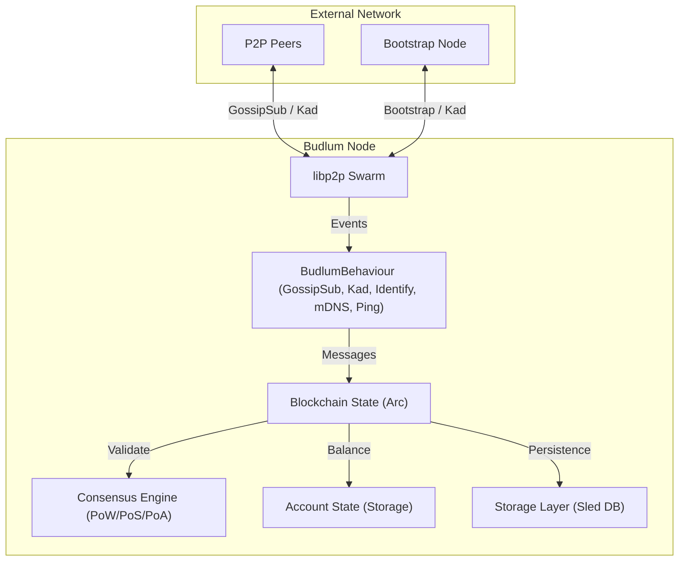

# Budlum Blockchain

A high-performance, decentralized, and privacy-focused blockchain implementation in Rust, featuring modular consensus and production-grade security.

## Features

- **P2P Networking**: Powered by `libp2p`.
  - **Kademlia DHT**: Decentralized peer discovery and WAN traversal.
  - **Identify Protocol**: Automatic public IP discovery for NAT traversal.
  - **GossipSub**: High-efficiency broadcast for blocks and transactions.
- **Advanced Security**: 
  - **Ed25519 Signatures**: Cryptographically secure transaction and block signing.
  - **Account Model**: Stateful account-based tracking with balance validation.
  - **Replay Protection**: Nonce-based transaction ordering and replay prevention.
- **Multi-Consensus Support**:
  - **Proof of Work (PoW)**: Brute-force verification with adjustable difficulty.
  - **Proof of Stake (PoS)**: Stake-weighted selection with double-sign detection, auto-slashing, and checkpoints.
  - **Proof of Authority (PoA)**: Quorum-based validator sets for private/permissioned networks.
- **Persistence**: Embedded `sled` database for atomic, high-performance storage.
- **Clean Codebase**: Minimalist implementation with 0% clutter, fully localized in English.

## Architecture

Budlum follows a modular architecture designed for decentralization and low latency.



### Core Components

1.  **Blockchain (`src/blockchain.rs`)**: Orchestrates the chain state and applies consensus rules.
2.  **Consensus (`src/consensus/`)**: Pluggable engines for different network types (PoW, PoS, PoA).
3.  **Account Management (`src/account.rs`)**: Handles balances, nonces, and transaction execution.
4.  **Cryptography (`src/crypto.rs`)**: Provides Ed25519 keypair management and signature verification.
5.  **Networking (`src/network/node.rs`)**: Manages the P2P swarm and peer discoverability.

## Getting Started

### Prerequisites

- [Rust](https://www.rust-lang.org/tools/install) (latest stable version)

### Building

```bash
cargo build --release
```

### Running

Start a node with PoW consensus:
```bash
cargo run -- --consensus pow --port 4001
```

Start a node with PoS consensus and specific stake:
```bash
cargo run -- --consensus pos --min-stake 1000 --port 4002
```

## CLI Usage

| Argument | Description | Default |
| :--- | :--- | :--- |
| `--consensus` | Consensus type (`pow`, `pos`, `poa`) | `pow` |
| `--port` | P2P listening port | `4001` |
| `--difficulty` | PoW mining difficulty | `2` |
| `--min-stake` | Minimum stake for PoS validators | `1000` |
| `--db-path` | Database storage path | `./data/budlum.db` |
| `--bootstrap` | Join network via multiaddr | (None) |

## Implementation Progress

- [x] Basic Blockchain Structure
- [x] P2P Networking (libp2p, GossipSub, Kad DHT)
- [x] Persistence (Sled Database Engine)
- [x] **Cryptographic Signatures (Ed25519)**
- [x] **Account & Balance Model**
- [x] **Proof of Work (PoW) Engine**
- [x] **Proof of Stake (PoS) with Slashing & Checkpoints**
- [x] **Proof of Authority (PoA) with Quorum Voting**
- [ ] Smart Contract VM (Upcoming)
- [ ] Stealth Address Privacy (Upcoming)
